# 📘 PANDUAN LENGKAP — Sistem Loket Pelayanan Pertanahan Elektronik BMN BALAM (LOKET2026)

**Dokumen gabungan dari:** PRD v1.1, PRD v2.0, Dokumentasi Perubahan (badge revisi & alur paralel), Dokumentasi Excel legacy, Changelog, dan 4 dokumen Diagram (Arsitektur/ERD, Alur Proses, UML, Wireframe).
**Ditambahkan baru:** Spesifikasi **Sistem Notifikasi & Konfirmasi Revisi** (lihat Bab 9).
**Disusun:** 7 September 2026 — untuk keperluan desain UI (Google Stitch) & acuan pengembangan.

---

## Daftar Isi

1. [Ringkasan Eksekutif](#1-ringkasan-eksekutif)
2. [Arsitektur & Tech Stack](#2-arsitektur--tech-stack)
3. [Role Pengguna & Otorisasi](#3-role-pengguna--otorisasi)
4. [Struktur Database Lengkap](#4-struktur-database-lengkap)
5. [Entity Relationship Diagram (ERD)](#5-entity-relationship-diagram-erd)
6. [Alur Kerja Utama (Workflow 5 Tahap)](#6-alur-kerja-utama-workflow-5-tahap)
7. [Mekanisme Revisi (Existing)](#7-mekanisme-revisi-existing)
8. [Modul per Tahap (Detail Fitur & Route)](#8-modul-per-tahap-detail-fitur--route)
9. [🆕 SISTEM NOTIFIKASI & KONFIRMASI REVISI (FITUR BARU)](#9-sistem-notifikasi--konfirmasi-revisi-fitur-baru)
10. [Use Case & Actor Matrix](#10-use-case--actor-matrix)
11. [Sequence Diagram Lengkap (termasuk Notifikasi)](#11-sequence-diagram-lengkap-termasuk-notifikasi)
12. [Activity Diagram — Lifecycle Tiket End-to-End](#12-activity-diagram--lifecycle-tiket-end-to-end)
13. [Class Diagram / Model Eloquent](#13-class-diagram--model-eloquent)
14. [Spesifikasi UI / Wireframe per Halaman](#14-spesifikasi-ui--wireframe-per-halaman)
15. [Modul Pendukung: Dashboard, Laporan, Arsip, Tracking, API](#15-modul-pendukung-dashboard-laporan-arsip-tracking-api)
16. [Master Data & Seeding](#16-master-data--seeding)
17. [Riwayat Perubahan (Changelog Ringkas)](#17-riwayat-perubahan-changelog-ringkas)

---

## 1. Ringkasan Eksekutif

**LOKET2026** adalah aplikasi web internal Kantor Pertanahan (Kantah) Kota Bandar Lampung yang mengotomasi seluruh alur pelayanan pertanahan — mulai dari pendaftaran berkas di Loket, pemeriksaan Verifikator, pencarian Warkah, Validasi Data Pertanahan, hingga penerbitan Sertifikat Elektronik melalui Alih Media. Sistem ini menggantikan alur kerja manual berbasis 8 file Excel besar (Dashboard Control, List Tiket Loket, Verifikator Berkas, Lembar Kerja Warkah, Lembar Kerja Validator, Lembar Kerja Alih Media, dll).

### Tujuan Utama
- Menggantikan sistem manual/Excel dengan aplikasi web terintegrasi.
- Menyediakan pelacakan real-time status berkas bagi petugas **dan** pemohon (via QR/tracking publik).
- Memastikan setiap tahapan tercatat dalam audit trail lengkap (`riwayat_statuses`).
- Menghasilkan Sertifikat Elektronik (TTD Digital) sebagai output final.
- **(Baru)** Memastikan setiap perpindahan tahap dan setiap revisi **selalu diketahui** oleh petugas tujuan melalui notifikasi + badge unread, dan setiap revisi **dikonfirmasi** sebelum dikerjakan.

### Cakupan Pengguna (Role)
| Role | Deskripsi |
|------|-----------|
| `admin` | Administrator sistem, akses penuh ke semua modul + arsip |
| `loket` | Petugas Loket Pelayanan (pendaftaran & tanda terima) |
| `verifikator` | Petugas Verifikasi kelengkapan berkas |
| `warkah` | Petugas pencarian/pemeriksaan arsip fisik (warkah) |
| `validator` | Petugas Validasi kesesuaian data pertanahan |
| `alih_media` | Petugas digitalisasi & penerbitan sertifikat elektronik |
| `pimpinan` | Kepala Kantor (read-only, laporan + arsip) |

### Lokasi & Versi
- **URL Internal**: `https://loket.balam.go.id` (production)
- **Versi Sistem**: Laravel 13 (PHP ≥ 8.3)

---

## 2. Arsitektur & Tech Stack

### Backend
| Komponen | Teknologi | Versi |
|----------|-----------|-------|
| Framework | Laravel | 13.17 |
| Bahasa | PHP | ≥ 8.3 |
| Database | MySQL / MariaDB | via Laragon |
| Excel Reader | PhpOffice\PhpSpreadsheet | via maatwebsite/excel ^4.0 |
| Testing | PHPUnit | 12.5.12 |
| Linter | Laravel Pint | 1.27 |

### Frontend
| Komponen | Teknologi | Versi |
|----------|-----------|-------|
| CSS Framework | Bootstrap | 5.3.3 (CDN) |
| Icon Library | Bootstrap Icons | 1.11.3 (CDN) |
| Font | Plus Jakarta Sans | Google Fonts |
| JS | Vanilla JS + Bootstrap Bundle | CDN |
| Template Engine | Blade | 25+ template |
| CSS Custom Properties | `--bpn-navy`, `--bpn-gold`, `--bpn-bg` | — |

### Diagram Arsitektur Global

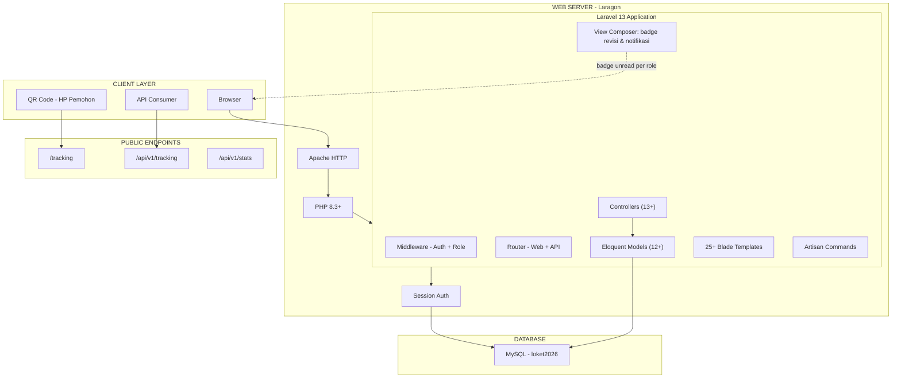

### Struktur Directory
```
LOKET2026/
├── app/
│   ├── Console/Commands/         (import:loket, import:loket-2026)
│   ├── Http/Controllers/         (Loket, Verifikator, Warkah, Validator,
│   │                               AlihMedia, Arsip, Dashboard, Report,
│   │                               Tracking, Api, Auth, [BARU] Notifikasi)
│   ├── Http/Middleware/          (RoleMiddleware)
│   └── Models/                   (User, Tiket, JenisPermohonan, BidangTanah,
│                                    VerifikasiBerkas, LembarKerjaWarkah,
│                                    LembarKerjaValidasi, LembarKerjaAlihMedia,
│                                    RiwayatStatus, TiketRevisi,
│                                    PersyaratanDokumen, SaranKoreksi,
│                                    [BARU] Notifikasi)
├── database/migrations/          (termasuk migration parallel-status +
│                                    tiket_revisis, dan [BARU] notifikasis)
├── resources/views/              (25+ blade, termasuk partials/stepper.blade.php
│                                    dan [BARU] partials/notification-bell.blade.php)
└── routes/ (web.php, api.php)
```

---

## 3. Role Pengguna & Otorisasi

### Autentikasi
- Login via **Username + Password** (bukan email), session-based auth Laravel.
- Middleware custom `RoleMiddleware` (tanpa Spatie Permission).
- Logika: belum login → redirect `/login` · `is_active=false` → logout paksa · `role=admin` → selalu diizinkan · role cocok daftar → izin · selain itu → 403.

### Matrix Akses Modul
| Role | Modul Utama | Arsip | Laporan |
|------|-------------|-------|---------|
| admin | Semua modul | Tulis + Baca | ✅ |
| loket | Loket | — | ✅ |
| verifikator | Verifikator | — | ✅ |
| warkah | Warkah | — | ✅ |
| validator | Validator | — | ✅ |
| alih_media | Alih Media | — | ✅ |
| pimpinan | Dashboard monitoring | Baca saja | ✅ |

---

## 4. Struktur Database Lengkap

> Skema di bawah menggabungkan seluruh migration: tabel inti, kolom arsip, kolom status paralel + `tiket_revisis`, dan tabel **baru** `notifikasis` untuk fitur notifikasi (Bab 9).

### 4.1 `users`
| Kolom | Tipe | Keterangan |
|---|---|---|
| id | bigint PK | |
| name | varchar(255) | Nama lengkap |
| username | varchar unique | Login |
| email | varchar | |
| password | varchar | Hashed |
| role | varchar/enum | admin/loket/verifikator/warkah/validator/alih_media/pimpinan |
| is_active | boolean | |

### 4.2 `jenis_permohonans`
| Kolom | Tipe | Keterangan |
|---|---|---|
| id | bigint PK | |
| kode | varchar(10) unique | JP01–JP15 |
| nama | varchar(200) | |
| kategori | enum(umum,bmn,alih_media) | |
| batas_hari_sla | int default 7 | |
| deskripsi | text nullable | |
| is_active | boolean default true | |

### 4.3 `persyaratan_dokumens`
id PK · jenis_permohonan_id FK (cascade) · nama_dokumen · wajib (bool) · keterangan · urutan.

### 4.4 `saran_koreksis`
id PK · jenis_permohonan_id FK nullable · nama_dokumen_kurang · pesan_koreksi (text) · dasar_hukum.

### 4.5 `tikets` (Tabel Utama)
| Kolom | Tipe | Keterangan |
|---|---|---|
| id | bigint PK | |
| no_tiket | varchar(50) unique | Format `K/{nomor}/{DDMMYY}/{iterasi}` |
| status_pembetulan | enum P0–P5 default P0 | Level iterasi perbaikan |
| tanggal_masuk | date | |
| jenis_permohonan_id | FK | |
| nama_pemohon, nik_pemohon, no_hp_pemohon | varchar | |
| jumlah_bidang | int default 1 | |
| petugas_loket_id | FK nullable → users | |
| **status** | enum 8 nilai default `diterima` | diterima/verifikasi/warkah/validasi/alih_media/selesai/dikembalikan/batal |
| **status_verifikator** | enum default `proses` | proses/tertunda/**revisi_ke_loket**/selesai |
| **status_warkah** | enum default `proses` | proses/**revisi**/selesai |
| **status_alih_media** | enum default `proses` | proses/selesai |
| status_sps, tanggal_sps | bool, date | |
| keterangan | text nullable | |
| tanggal_target_selesai, tanggal_selesai | date | |
| periode, tahun, sumber_data | string/int | Kolom arsip + auto-fill |
| diarsipkan_pada, diarsipkan_oleh | timestamp, FK | |

### 4.6 `bidang_tanahs`
id PK · tiket_id FK (cascade) · nib · no_sertifikat_lama · no_sertifikat_elektronik · jenis_hak (HM/HGB/HGU/HP/HPL) · nama_pemegang_hak · luas_m2 · desa_kelurahan · kecamatan · status_plotting · urutan.

### 4.7 `verifikasi_berkas`
id PK · tiket_id FK · verifikator_id FK nullable · iterasi · tanggal_diterima · tanggal_selesai · status (proses/lengkap/perbaikan/batal) · catatan · dokumen_kurang (json).

### 4.8 `lembar_kerja_warkahs`
id PK · tiket_id FK · bidang_id FK nullable · petugas_id FK nullable · tanggal_mulai/selesai · lokasi_fisik · kondisi (baik/rusak/tidak_terbaca) · status_keberadaan (ada/tidak_ada/perlu_dicari) · status_scan (bool) · catatan.

### 4.9 `lembar_kerja_validasis`
id PK · tiket_id FK · bidang_id FK nullable · validator_id FK nullable · tanggal_mulai/selesai · kesesuaian_nama, kesesuaian_luas (sesuai/tidak_sesuai) · **status_pra_btel**, **status_pra_suel** (belum/proses/selesai) · status_validasi (proses/lulus/perlu_koreksi/ditolak) · catatan · diteruskan_alih_media (bool) · **status_validasi_bidang** (proses/lulus) · **catatan_validator**.

### 4.10 `lembar_kerja_alih_medias`
id PK · tiket_id FK · bidang_id FK nullable · petugas_id FK nullable · tanggal_mulai/selesai · status_scan_buku_tanah, status_scan_surat_ukur (belum/sudah/kualitas_buruk) · status_scan_warkah, status_upload_kkp, status_ttd_elektronik (belum/sudah) · tanggal_terbit_sertifikat_el · catatan.

### 4.11 `riwayat_statuses` (Audit Trail)
id PK · tiket_id FK (cascade) · stage_dari · stage_ke · changed_by FK nullable · keterangan (text) · created_at.

### 4.12 `tiket_revisis` (Mekanisme Revisi Antar Tahap)
| Kolom | Tipe | Keterangan |
|---|---|---|
| id | bigint PK | |
| tiket_id | FK (cascade) | |
| stage_asal | string(50) | Tahap **pengirim revisi** (yang menemukan masalah) |
| stage_tujuan | string(50) | Tahap **penerima revisi** (yang harus memperbaiki) |
| sub_bidang | string(20) nullable | `pra_btel` / `pra_suel` (khusus Validator↔Alih Media) |
| pesan_catatan | text | **Isi lengkap revisi — diisi oleh stage pembuat revisi** |
| status | enum | `aktif` → `dikonfirmasi` *(baru)* → `tertangani` |
| created_by | FK nullable → users | |
| **dikonfirmasi_pada** *(baru)* | timestamp nullable | Waktu stage tujuan menekan "Konfirmasi Terima" |
| **dikonfirmasi_oleh** *(baru)* | FK nullable → users | User yang konfirmasi |
| created_at, updated_at | timestamp | |

### 4.13 `notifikasis` 🆕 (Tabel Baru — Sistem Notifikasi)
| Kolom | Tipe | Keterangan |
|---|---|---|
| id | bigint PK | |
| tiket_id | FK → tikets (cascade) | Tiket terkait |
| tiket_revisi_id | FK nullable → tiket_revisis | Diisi jika notifikasi terkait revisi |
| role_tujuan | string(30) | Role yang menerima notifikasi (loket/verifikator/warkah/validator/alih_media/admin) |
| tipe | enum | `forward_masuk`, `revisi_masuk`, `revisi_dikonfirmasi`, `revisi_selesai_dikirim_ulang` |
| judul | varchar(150) | Judul singkat notifikasi |
| pesan | text | Isi pesan (mengambil `pesan_catatan` bila tipe revisi) |
| butuh_konfirmasi | boolean default false | true khusus `revisi_masuk` |
| is_read | boolean default false | Status dibaca |
| dibaca_oleh | FK nullable → users | |
| dibaca_pada | timestamp nullable | |
| created_at | timestamp | |

> **Catatan desain:** karena satu role bisa memiliki lebih dari satu user (mis. beberapa petugas Verifikator), `is_read` bersifat **per-role-queue** (begitu satu petugas membuka detail tiket, notifikasi untuk role tersebut otomatis `is_read=true`). Ini konsisten dengan pola `revisiCounts` yang sudah dihitung per-role di `AppServiceProvider`.

---

## 5. Entity Relationship Diagram (ERD)

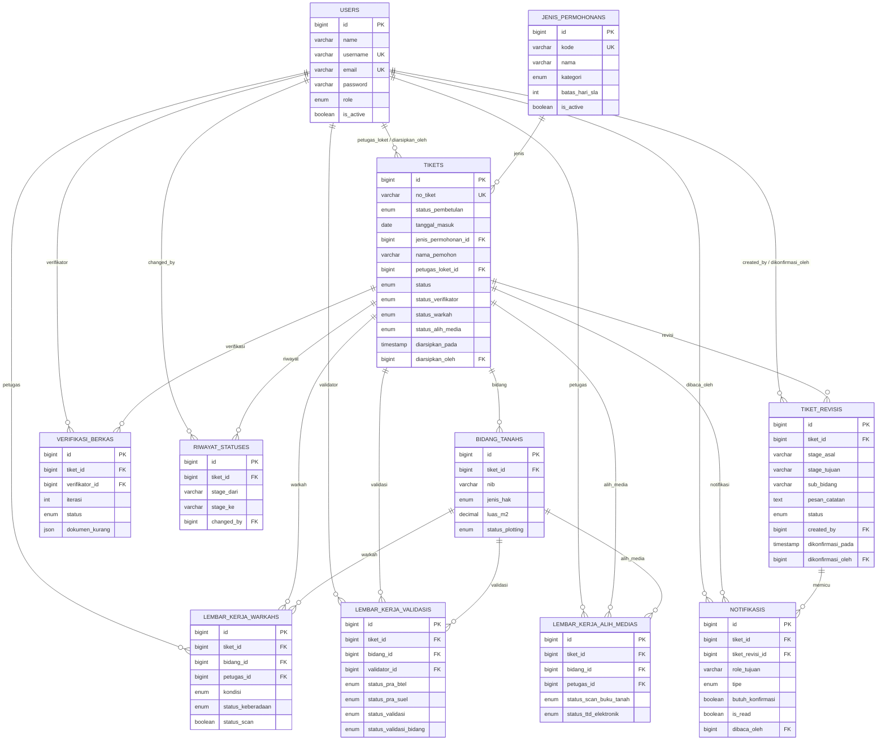

---

## 6. Alur Kerja Utama (Workflow 5 Tahap)

### 6.1 Status Tiket (Enum 8 Nilai)
| Status | Label | Badge Warna |
|--------|-------|-------|
| `diterima` | Diterima di Loket | kuning (warning) |
| `verifikasi` | Pemeriksaan Verifikator | biru muda (info) |
| `warkah` | Pencarian Warkah | abu-abu (secondary) |
| `validasi` | Validasi Data Pertanahan | biru (primary) |
| `alih_media` | Proses Alih Media | hitam (dark) |
| `selesai` | Selesai (Sertifikat Terbit) | hijau (success) |
| `dikembalikan` | Dikembalikan (Perlu Perbaikan) | merah (danger) |
| `batal` | Dibatalkan | merah (danger) |

### 6.2 Alur Kerja Normal (Happy Path)
```
LOKET (P0–P5) → VERIFIKATOR ─┬─→ WARKAH → VALIDASI → ALIH MEDIA → SELESAI (Sertifikat Elektronik)
                              └─ (paralel dengan Verifikator, keduanya harus selesai sebelum lanjut ke Validasi)
```
Verifikator dan Warkah berjalan **paralel** setelah tiket diteruskan dari Loket. Validator baru bisa memproses setelah kedua status (`status_verifikator=selesai` dan `status_warkah=selesai`) terpenuhi.

### 6.3 Status Pembetulan (Iterasi P0–P5)
| Level | Keterangan |
|-------|------------|
| P0 | Permohonan awal |
| P1–P4 | Perbaikan ke-1 s/d ke-4 |
| P5 | Perbaikan maksimal |

Setiap perbaikan → `VerifikasiBerkas` baru dibuat (iterasi bertambah) + `RiwayatStatus` dicatat.

### 6.4 Tabel Transisi Status Resmi
| Dari | Ke | Aksi | Controller |
|------|----|------|------------|
| (baru) | diterima | Input tiket baru | LoketController@store |
| diterima | verifikasi | Forward ke Verifikator | LoketController@forward |
| dikembalikan | verifikasi | Resubmit perbaikan (P++) | LoketController@resubmit |
| verifikasi | warkah | Berkas lengkap | VerifikatorController@update (lengkap) |
| verifikasi | dikembalikan | Perlu perbaikan (revisi ke Loket) | VerifikatorController@update (perbaikan) |
| verifikasi | batal | Dibatalkan | VerifikatorController@update (batal) |
| warkah | validasi | Warkah selesai, teruskan Validator | WarkahController@update (forward_to_validator) |
| validasi | alih_media | Lulus semua bidang (gatekeeper Pra-BTel/Pra-SuEl) | ValidatorController@update (approve_and_forward) |
| validasi | warkah/verifikator | Dikembalikan (revisi) | ValidatorController@update (return_to_warkah / return_to_verifikator) |
| validasi | batal | Ditolak | ValidatorController@update (reject) |
| alih_media | selesai | Sertifikat Elektronik terbit | AlihMediaController@update (complete_and_publish) |
| alih_media | validasi | Revisi ke Validator (per sub_bidang) | AlihMediaController@update (return_to_validator) |

### 6.5 Diagram Alur Paralel Verifikator + Warkah

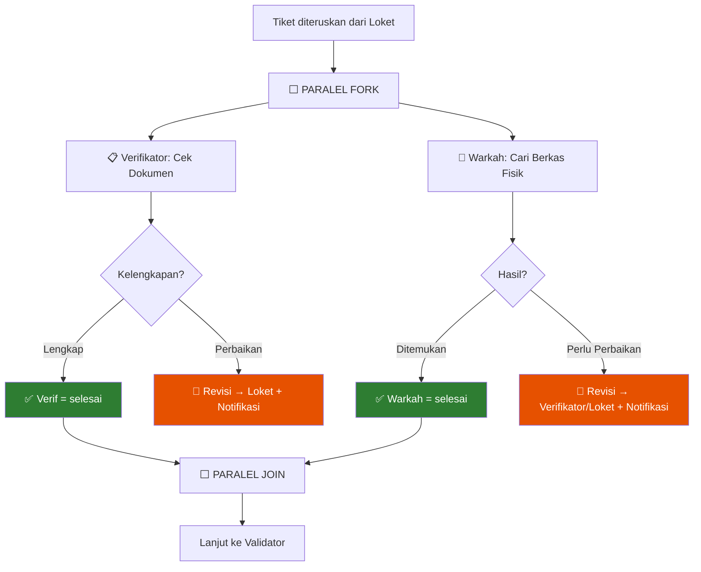

---

## 7. Mekanisme Revisi (Existing)

Fitur ini **sudah ada** di codebase (migration `2026_09_01_000001_add_parallel_status_and_tiket_revisis_table`) dan menjadi **fondasi** untuk fitur notifikasi baru di Bab 9.

### 7.1 Peta Jalur Revisi Antar Tahap
| Stage Asal (pembuat revisi) | Stage Tujuan (penerima revisi) | Catatan |
|---|---|---|
| Verifikator | Loket | Dokumen kurang lengkap |
| Warkah | Verifikator / Loket | Berkas fisik tidak ditemukan/rusak |
| Validator | Warkah | Data warkah tidak sesuai |
| Validator | Verifikator | Dokumen tidak sesuai |
| Alih Media | Validator | Sub-bidang: `pra_btel`, `pra_suel`, atau "Semua Bidang" |

### 7.2 Perilaku Sebelum Penambahan Fitur Baru
- `AppServiceProvider` menghitung `revisiCounts` per role (**hanya angka**, tanpa status baca/belum baca per item, tanpa alur konfirmasi).
- Badge merah muncul di sidebar bila `revisiCounts[role] > 0`.
- Halaman detail (`validator/show.blade.php`, `alih_media/show.blade.php`) menampilkan **alert kuning** berisi `sub_bidang` + `pesan_catatan` dari relasi `activeRevisis`.
- **Kelemahan yang diperbaiki di Bab 9**: petugas tujuan bisa langsung mengerjakan revisi tanpa "acknowledge" eksplisit, dan pengirim revisi tidak tahu kapan revisinya mulai dikerjakan.

---

## 8. Modul per Tahap (Detail Fitur & Route)

### 8.1 Modul Loket (Stage 1)
**Controller**: `LoketController` · **Prefix**: `/loket` · **Middleware**: `role:loket`

| Method | URI | Fungsi |
|---|---|---|
| GET | `/loket` | Daftar tiket aktif (+ **badge notifikasi baru & revisi masuk**) |
| GET | `/loket/create` | Form registrasi baru |
| POST | `/loket` | Simpan tiket baru |
| GET | `/loket/{id}` | Detail tiket (+ **panel konfirmasi revisi** bila ada) |
| POST | `/loket/{id}/forward` | Teruskan ke Verifikator → **memicu notifikasi forward** |
| POST | `/loket/{id}/resubmit` | Resubmit perbaikan (P++) → **memicu notifikasi "revisi selesai dikirim ulang"** |
| POST | `/loket/{id}/konfirmasi-revisi` 🆕 | Konfirmasi telah menerima revisi dari Verifikator/Warkah |
| GET | `/loket/{id}/print-receipt` \| `/print-checklist` | Cetak dokumen |

### 8.2 Modul Verifikator (Stage 2)
**Controller**: `VerifikatorController` · **Prefix**: `/verifikator` · **Middleware**: `role:verifikator`

| status_verifikasi | Transisi |
|---|---|
| lengkap | → warkah (auto-create `LembarKerjaWarkah` per bidang) |
| perbaikan | → dikembalikan (status=dikembalikan, status_verif=revisi_ke_loket) + **buat TiketRevisi + Notifikasi ke Loket** |
| batal | → batal |

Route tambahan 🆕: `POST /verifikator/{id}/konfirmasi-revisi` (jika Verifikator menerima revisi dari Warkah).

### 8.3 Modul Warkah (Stage 3)
**Controller**: `WarkahController` · **Prefix**: `/warkah` · **Middleware**: `role:warkah`

| action_type | Hasil |
|---|---|
| save_draft | Simpan draf |
| forward_to_validator | status → validasi, buat `LembarKerjaValidasi` per bidang → **notifikasi forward ke Validator** |
| return_to_verifikator/loket 🆕 | Buat `TiketRevisi` + **notifikasi revisi ke stage sebelumnya** |

### 8.4 Modul Validasi (Stage 4)
**Controller**: `ValidatorController` · **Prefix**: `/validator` · **Middleware**: `role:validator`

Gatekeeper: hanya bisa `approve_and_forward` jika **semua bidang** `status_pra_btel=selesai` **dan** `status_pra_suel=selesai`.

| action_type | Transisi |
|---|---|
| save_draft | tetap validasi |
| approve_and_forward | → alih_media, buat `LembarKerjaAlihMedia` → **notifikasi forward ke Alih Media** |
| return_to_warkah / return_to_verifikator | → buat `TiketRevisi` → **notifikasi revisi + butuh konfirmasi** |
| reject | → batal |

### 8.5 Modul Alih Media (Stage 5)
**Controller**: `AlihMediaController` · **Prefix**: `/alih-media` · **Middleware**: `role:alih_media`

| action_type | Hasil |
|---|---|
| save_draft | tetap alih_media |
| complete_and_publish | status → selesai, terbit Sertifikat Elektronik → **notifikasi "Selesai" ke Loket (informasi pemohon bisa diambil)** |
| return_to_validator | Buat `TiketRevisi` (sub_bidang) → **notifikasi revisi ke Validator + butuh konfirmasi** |

---

## 9. 🆕 SISTEM NOTIFIKASI & KONFIRMASI REVISI (FITUR BARU)

> Ini adalah bagian **inti permintaan tambahan** Anda. Dirancang di atas tabel `tiket_revisis` yang sudah ada, ditambah tabel baru `notifikasis` (Bab 4.13).

### 9.1 Konsep Umum

Ada **dua jenis notifikasi**:

1. **Notifikasi Forward (maju ke tahap berikutnya)**
   Saat sebuah tiket diteruskan ke tahap berikutnya (mis. Loket → Verifikator), sistem membuat 1 baris `notifikasis` untuk `role_tujuan` tahap berikutnya, `tipe = forward_masuk`, `is_read = false`. Badge angka di sidebar tahap tersebut **bertambah 1**. Tidak butuh konfirmasi — status otomatis `is_read = true` begitu petugas membuka halaman detail tiket tersebut.

2. **Notifikasi Revisi (mundur ke tahap sebelumnya) — butuh konfirmasi**
   Saat sebuah tahap mengembalikan tiket ke tahap sebelumnya dengan catatan perbaikan, sistem:
   - Membuat/mengupdate baris `tiket_revisis` (`status = aktif`, `pesan_catatan` = isi catatan revisi dari stage pembuat revisi).
   - Membuat baris `notifikasis` untuk `role_tujuan` = stage sebelumnya, `tipe = revisi_masuk`, `butuh_konfirmasi = true`.
   - Badge di sidebar stage sebelumnya bertambah, **ditandai warna berbeda** (mis. merah pekat) agar dibedakan dari notifikasi forward biasa (biru).

   Tiket **tidak otomatis dianggap "diterima"** hanya karena dibuka — tahap sebelumnya **wajib menekan tombol "Konfirmasi Terima Revisi"** di halaman detail tiket sebelum mulai mengerjakan.

### 9.2 Alur Lengkap Sesuai Permintaan Anda

```
Stage B menemukan masalah pada tiket milik Stage A
   │
   ├─▶ Stage B mengisi CATATAN REVISI (wajib) via form "Kembalikan ke Stage A"
   │
   ▼
[1] Tiket masuk ke tiket_revisis (status=aktif) + notifikasi baru untuk Stage A
   │   → Badge unread Stage A bertambah 1 (warna revisi)
   │   → Tiket muncul di daftar kerja Stage A dengan tag "🔴 Perlu Revisi"
   ▼
Stage A membuka detail tiket → melihat isi CATATAN REVISI dari Stage B
   │
   ├─▶ Stage A menekan tombol "✅ Konfirmasi Terima Revisi"
   │
   ▼
[2] tiket_revisis.status → dikonfirmasi (+ dikonfirmasi_pada, dikonfirmasi_oleh)
   │   → notifikasi baru utk Stage B: tipe=revisi_dikonfirmasi
   │   → Stage B melihat status tiket: "Diterima oleh Stage A, sedang diproses"
   ▼
Stage A memperbaiki data sesuai catatan → menekan "Kirim Kembali / Teruskan"
   │
   ▼
[3] tiket_revisis.status → tertangani
   │   → status/​sub-status tiket kembali maju ke Stage B (mis. status_verifikator=proses lagi)
   │   → notifikasi baru untuk Stage B: tipe=revisi_selesai_dikirim_ulang (forward_masuk biasa)
   │   → Tiket kembali muncul di daftar kerja Stage B (badge Stage B bertambah)
```

Ini **persis** memenuhi 4 poin permintaan Anda:
1. ✅ Setiap naik ke tahap berikutnya → notifikasi + angka badge unread di sidebar.
2. ✅ Setiap dikembalikan (revisi) → tahap sebelumnya dapat notifikasi + tombol konfirmasi; isi revisi selalu dari catatan yang diisi pembuat revisi.
3. ✅ Setelah dikonfirmasi → pembuat revisi mendapat pemberitahuan "tiket diterima & sedang diproses".
4. ✅ Setelah tahap sebelumnya selesai revisi dan mengirim ulang → otomatis masuk ke menu/daftar kerja tahap yang meminta revisi.

### 9.3 Tabel Ringkasan Trigger Notifikasi

| # | Event Pemicu | Dibuat Oleh | Penerima (role_tujuan) | Tipe | Butuh Konfirmasi? |
|---|---|---|---|---|---|
| 1 | Loket forward tiket baru | LoketController@forward | verifikator | forward_masuk | Tidak |
| 2 | Verifikator selesai (lengkap) | VerifikatorController@update | (warkah sudah paralel sejak awal — hanya update status) | forward_masuk | Tidak |
| 3 | Verifikator perbaikan | VerifikatorController@update | **loket** | revisi_masuk | **Ya** |
| 4 | Warkah forward ke Validator | WarkahController@update | validator | forward_masuk | Tidak |
| 5 | Warkah kembalikan (revisi) | WarkahController@update | verifikator/loket | revisi_masuk | **Ya** |
| 6 | Loket konfirmasi revisi diterima | LoketController@konfirmasiRevisi | **verifikator** (pengirim revisi) | revisi_dikonfirmasi | Tidak |
| 7 | Loket resubmit setelah perbaikan | LoketController@resubmit | verifikator | revisi_selesai_dikirim_ulang | Tidak |
| 8 | Validator approve & forward | ValidatorController@update | alih_media | forward_masuk | Tidak |
| 9 | Validator kembalikan ke Warkah/Verifikator | ValidatorController@update | warkah/verifikator | revisi_masuk | **Ya** |
| 10 | Alih Media selesai & terbit | AlihMediaController@update | loket (info pemohon) | forward_masuk (info selesai) | Tidak |
| 11 | Alih Media kembalikan ke Validator | AlihMediaController@update | validator | revisi_masuk | **Ya** |
| 12 | Stage manapun konfirmasi revisi (generik) | `{Stage}Controller@konfirmasiRevisi` | stage pembuat revisi (stage_asal) | revisi_dikonfirmasi | Tidak |
| 13 | Stage manapun kirim ulang setelah revisi (generik) | `{Stage}Controller@kirimUlangRevisi` | stage_asal (peminta revisi) | revisi_selesai_dikirim_ulang | Tidak |

### 9.4 Perubahan Skema Database (Migration Baru)

```php
// 1) Tambah kolom konfirmasi pada tiket_revisis
Schema::table('tiket_revisis', function (Blueprint $table) {
    $table->timestamp('dikonfirmasi_pada')->nullable();
    $table->foreignId('dikonfirmasi_oleh')->nullable()->constrained('users')->nullOnDelete();
    // ubah enum status: aktif -> dikonfirmasi -> tertangani
});

// 2) Tabel baru notifikasis
Schema::create('notifikasis', function (Blueprint $table) {
    $table->id();
    $table->foreignId('tiket_id')->constrained('tikets')->cascadeOnDelete();
    $table->foreignId('tiket_revisi_id')->nullable()->constrained('tiket_revisis')->nullOnDelete();
    $table->string('role_tujuan', 30);
    $table->enum('tipe', ['forward_masuk','revisi_masuk','revisi_dikonfirmasi','revisi_selesai_dikirim_ulang']);
    $table->string('judul', 150);
    $table->text('pesan');
    $table->boolean('butuh_konfirmasi')->default(false);
    $table->boolean('is_read')->default(false);
    $table->foreignId('dibaca_oleh')->nullable()->constrained('users')->nullOnDelete();
    $table->timestamp('dibaca_pada')->nullable();
    $table->timestamps();
});
```

### 9.5 Perubahan Model & Service

- **`Notifikasi` (Model baru)** — `belongsTo(Tiket::class)`, `belongsTo(TiketRevisi::class)`, `scopeUnreadForRole($role)`, `scopeButuhKonfirmasi()`.
- **`TiketRevisi` (update)** — tambah method `konfirmasi(User $user)` (set `status=dikonfirmasi`, `dikonfirmasi_pada`, `dikonfirmasi_oleh`, lalu buat `Notifikasi` untuk `stage_asal`), dan `tandaiTertangani()` (set `status=tertangani`).
- **`NotificationService` (Service class baru)** — method `kirimForward(Tiket $tiket, string $roleTujuan)`, `kirimRevisi(Tiket $tiket, TiketRevisi $revisi)`, `konfirmasiRevisi(TiketRevisi $revisi, User $user)`, `kirimUlangSetelahRevisi(TiketRevisi $revisi)`. Dipanggil di dalam `DB::transaction()` yang sama dengan update status tiket, agar konsisten dengan pola existing (`RiwayatStatus` juga dicatat di transaksi yang sama).
- **`AppServiceProvider` (update View Composer)** — ganti/lengkapi `revisiCounts` menjadi `notifCounts` per role:
  ```php
  $notifCounts = [
      'loket'        => Notifikasi::unreadForRole('loket')->count(),
      'verifikator'  => Notifikasi::unreadForRole('verifikator')->count(),
      'warkah'       => Notifikasi::unreadForRole('warkah')->count(),
      'validator'    => Notifikasi::unreadForRole('validator')->count(),
      'alih_media'   => Notifikasi::unreadForRole('alih_media')->count(),
  ];
  $revisiPendingCounts = [ /* khusus butuh_konfirmasi=true, untuk badge merah terpisah */ ];
  ```

### 9.6 Route Baru
```php
// Ditambahkan di masing-masing prefix stage (loket, verifikator, warkah, validator, alih-media)
Route::post('{id}/konfirmasi-revisi', [XController::class, 'konfirmasiRevisi'])->name('x.konfirmasi-revisi');
Route::post('notifikasi/{id}/baca', [NotifikasiController::class, 'tandaiBaca'])->name('notifikasi.baca');
Route::get('notifikasi', [NotifikasiController::class, 'index'])->name('notifikasi.index'); // dropdown bell
```

### 9.7 Spesifikasi UI Notifikasi

**a. Badge Sidebar (per menu tahap)**
- Bulatan angka (`bg-danger rounded-pill`) di kanan label menu, seperti badge revisi yang sudah ada.
- Jika ada **≥1 notifikasi biasa (forward)** → badge biru muda kecil.
- Jika ada **≥1 revisi yang butuh konfirmasi** → badge merah menyala + ikon 🔔 berdenyut (CSS `animation: pulse`).
- Angka = total unread (`forward_masuk` + `revisi_masuk` yang belum dibaca).

**b. Ikon Lonceng di Header (Notification Bell)**
- Dropdown menampilkan daftar notifikasi terbaru (maks. 10), masing-masing menunjukkan: No. Tiket, jenis notifikasi (ikon berbeda: ➡️ forward, 🔴 revisi masuk, ✅ revisi dikonfirmasi, 🔁 dikirim ulang), waktu, dan tombol "Buka".
- Klik "Buka" → redirect ke detail tiket + `is_read=true`.

**c. Panel di Halaman Detail Tiket (mis. `loket/show.blade.php`)**
- Alert box merah (bila ada revisi aktif untuk stage ini):
  ```
  🔴 REVISI DARI VERIFIKATOR
  "Dokumen KTP pemohon tidak terbaca, mohon di-scan ulang." — dikirim 07/09/2026 10:15
  [ ✅ Konfirmasi Terima Revisi ]
  ```
- Setelah diklik → alert berubah jadi:
  ```
  ✅ Revisi telah dikonfirmasi pada 07/09/2026 10:20 oleh (nama user).
  Silakan perbaiki data lalu tekan "Kirim Kembali ke Verifikator".
  ```
- Tombol "Kirim Kembali" hanya muncul setelah status `dikonfirmasi`.

**d. Sisi Pengirim Revisi (mis. halaman `verifikator/show.blade.php`)**
- Setelah Loket konfirmasi, tiket menampilkan badge status: `⏳ Sedang diproses oleh Loket` (bukan lagi "Menunggu Konfirmasi").
- Setelah Loket kirim ulang, tiket otomatis kembali ke daftar `Verifikator` dengan tag `🔁 Kiriman Ulang (P{n})`.

### 9.8 Sequence Diagram — Alur Revisi + Konfirmasi (Detail)

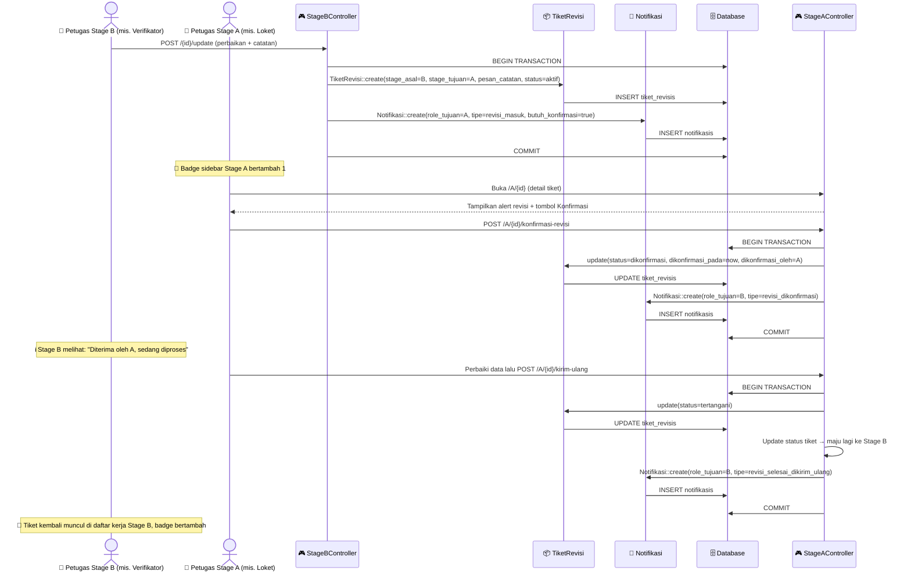

### 9.9 State Diagram — Status `tiket_revisis`

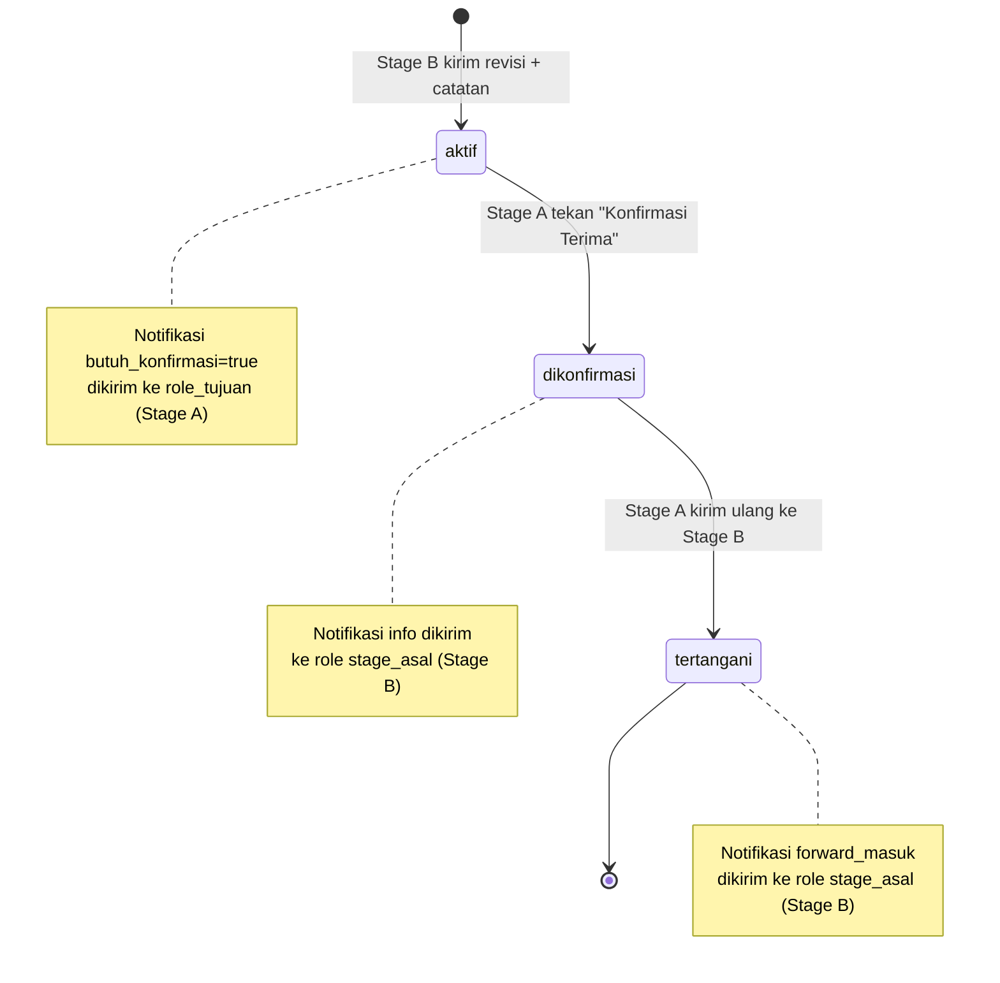

---

## 10. Use Case & Actor Matrix

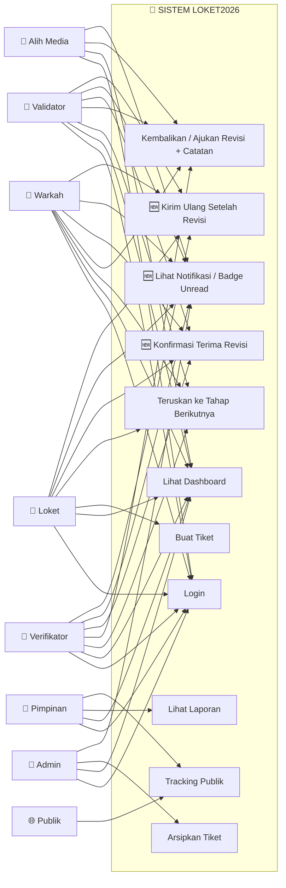

### Matrix Fitur Notifikasi per Role
| Fitur | Admin | Loket | Verif | Warkah | Validator | AM | Pimpinan |
|---|:---:|:---:|:---:|:---:|:---:|:---:|:---:|
| Badge unread forward | ✅ (semua) | ✅ | ✅ | ✅ | ✅ | ✅ | — |
| Badge unread revisi masuk | ✅ (semua) | ✅ | ✅ | ✅ | ✅ | — | — |
| Tombol Konfirmasi Revisi | — | ✅ | ✅ | ✅ | ✅ | — | — |
| Notifikasi "revisi dikonfirmasi" | — | — | ✅ | ✅ | ✅ | ✅ | — |
| Dropdown lonceng notifikasi | ✅ | ✅ | ✅ | ✅ | ✅ | ✅ | ✅ (read-only) |

---

## 11. Sequence Diagram Lengkap (termasuk Notifikasi)

### 11.1 Forward Tiket (Loket → Verifikator) dengan Notifikasi
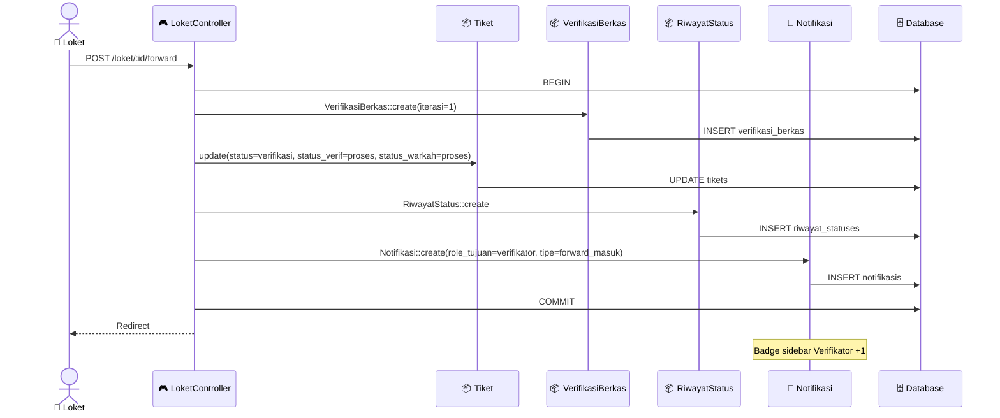

### 11.2 Login
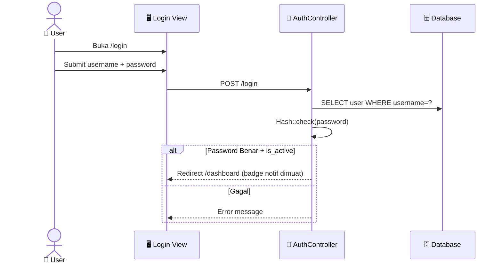

### 11.3 Tracking Publik
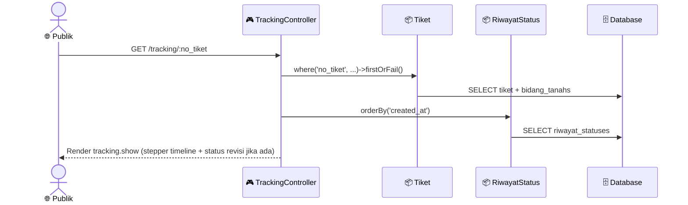

---

## 12. Activity Diagram — Lifecycle Tiket End-to-End

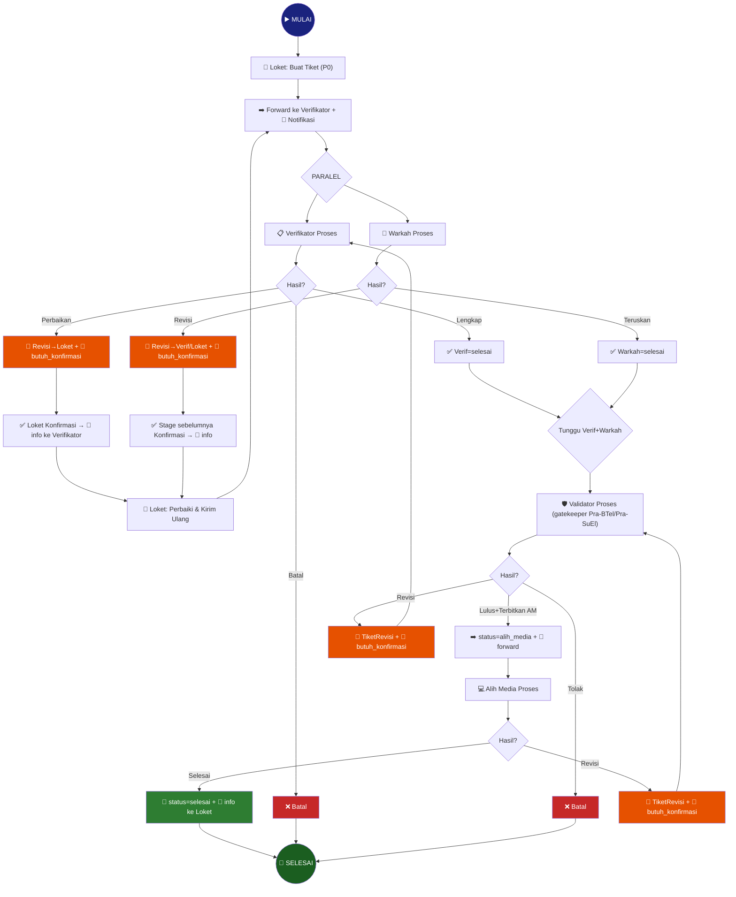

---

## 13. Class Diagram / Model Eloquent

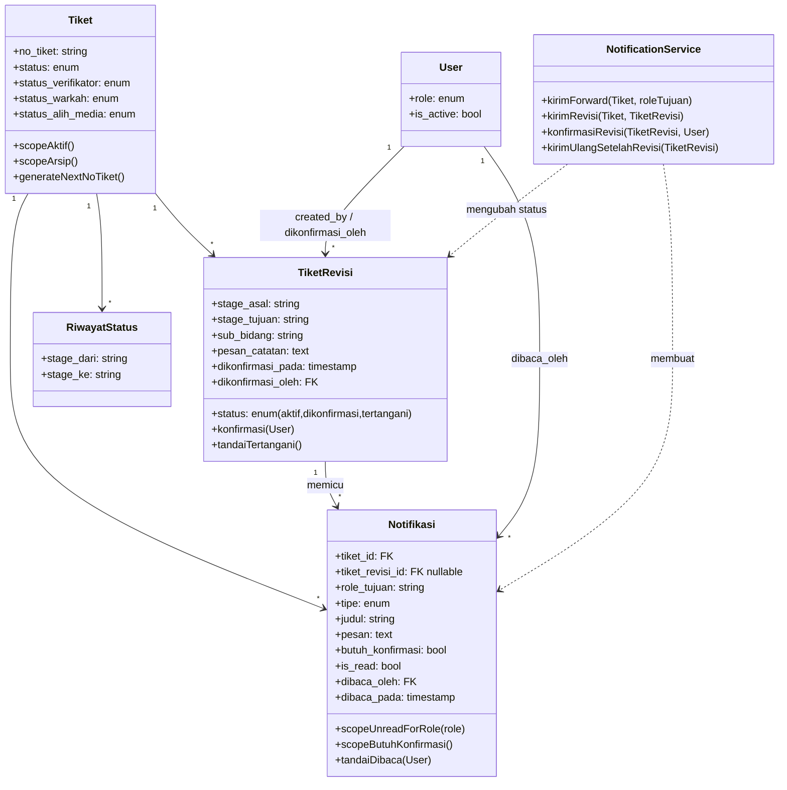

---

## 14. Spesifikasi UI / Wireframe per Halaman

> Bagian ini paling relevan untuk digunakan langsung sebagai prompt desain di **Google Stitch**. Setiap layout memakai pola dasar: **Sidebar (kiri)** + **Header (atas, dengan 🔔 lonceng notifikasi)** + **Content (tengah)**.

### 14.1 Login Page
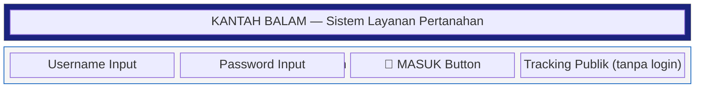

### 14.2 Dashboard (Layout Utama, dengan Notifikasi)
```mermaid
block-beta
    columns 5
    block:SIDEBAR["Sidebar Nav"]:1
        S1["🏠 Dashboard"]
        S2["📋 Loket 🔴3"]
        S3["✅ Verifikator 🔵2"]
        S4["📁 Warkah"]
        S5["🛡️ Validator 🔴1"]
        S6["💻 Alih Media"]
        S7["📈 Laporan"]
        S8["🗄️ Arsip"]
    end
    block:TOPBAR["Header"]:4
        T1["🔔 Bell Dropdown Notifikasi (badge count)"]
        T2["👤 User + Role"]
    end
    block:CONTENT["Dashboard"]:4
        C1["📊 Statistik: Total/Proses/Selesai/Arsip/Revisi Menunggu"]
        C2["📋 Tabel Tiket Terbaru + kolom 'Status Notifikasi'"]
    end
    style SIDEBAR fill:#1a237e,color:#fff
    style TOPBAR fill:#0d47a1,color:#fff
```
Keterangan badge sidebar: **angka biru** = forward masuk baru (belum dibuka); **angka merah + ikon 🔔 berdenyut** = ada revisi yang **butuh konfirmasi**.

### 14.3 Detail Tiket + Panel Notifikasi/Revisi (Contoh: Loket)
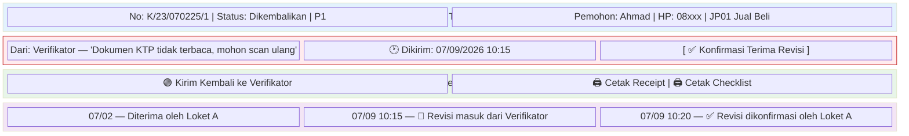

### 14.4 Dropdown Notifikasi (Header Bell) 🆕
```mermaid
block-beta
    columns 1
    block:BELLHEAD["🔔 Notifikasi (5 belum dibaca)"]:1
    end
    block:LIST["Daftar Notifikasi"]:1
        N1["➡️ [Forward] Tiket K/12/.../1 masuk ke antrian Anda — 2 menit lalu"]
        N2["🔴 [Revisi] Tiket K/09/.../2 dikembalikan — perlu konfirmasi — 10 menit lalu"]
        N3["✅ [Info] Revisi tiket K/05/.../1 telah dikonfirmasi Loket — 1 jam lalu"]
        N4["🔁 [Dikirim Ulang] Tiket K/05/.../1 kembali ke antrian Anda — 30 menit lalu"]
    end
    block:FOOTER["Lihat Semua Notifikasi →"]:1
    end
    style BELLHEAD fill:#0d47a1,color:#fff
    style LIST fill:#fff
```

### 14.5 Modul Arsip (3-Panel) — tidak berubah
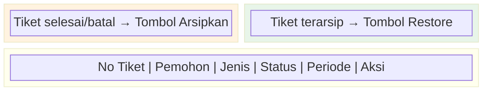

### 14.6 Component Hierarchy (Update)
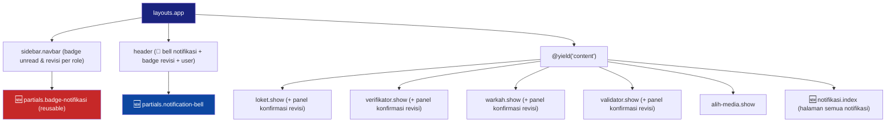

---

## 15. Modul Pendukung: Dashboard, Laporan, Arsip, Tracking, API

### 15.1 Dashboard
**Controller**: `DashboardController` · Route: `GET /dashboard`

KPI: Total Permohonan Aktif, Masuk Hari Ini, Selesai, Perlu Perbaikan (dikembalikan), Overdue SLA, **🆕 Revisi Menunggu Konfirmasi (per role)**. Breakdown per status. Konten disesuaikan role (loket lihat status diterima, dst).

### 15.2 Laporan & Monitoring
**Controller**: `ReportController` · Prefix `/reports`

Filter: tanggal awal/akhir, jenis layanan, status. Statistik: Total Masuk, Selesai, Dalam Proses, Perbaikan/Batal, Persentase selesai. Cetak via `window.print()` (tanpa DomPDF).

### 15.3 Modul Arsip Tahunan
**Controller**: `ArsipController` · Prefix `/arsip` · `role:admin,pimpinan`

| Method | URI | Fungsi |
|---|---|---|
| GET | `/arsip` | Daftar arsip + panel siap arsip |
| GET | `/arsip/{id}` | Detail tiket arsip |
| POST | `/arsip/{id}/arsipkan` | Arsipkan 1 tiket |
| POST | `/arsip/arsipkan-massal` | Arsipkan beberapa tiket |
| POST | `/arsip/arsipkan-tahun/{tahun}` | Arsipkan semua selesai/batal per tahun |
| POST | `/arsip/{id}/restore` | Kembalikan dari arsip |

Mekanisme: `aktif()` = `diarsipkan_pada IS NULL`; `arsip()` = `diarsipkan_pada IS NOT NULL`; `siapArsip()` = status selesai/batal & belum diarsipkan.

### 15.4 Tracking Publik
**Controller**: `TrackingController` · URL `/tracking` (tanpa login)

| Method | URI | Fungsi |
|---|---|---|
| GET | `/tracking` | Form pencarian |
| GET | `/tracking/{no_tiket}` | Status tiket (mendukung slash: `/tracking/K/1/280826/1`) |

Fitur: QR-compatible, hero banner navy, stepper timeline visual, riwayat perjalanan detail, notifikasi sertifikat terbit.

### 15.5 REST API v1
**Controller**: `ApiController` · Prefix `/api/v1` · publik tanpa auth

| Endpoint | Response |
|---|---|
| `GET /tracking/{no_tiket}` | status, status_label, tanggal, jenis_permohonan, bidang_tanah[], riwayat_timeline[] |
| `GET /stats` | total_tiket, tiket_hari_ini, tiket_selesai, stage_counts, overdue_sla |
| `GET /jenis-permohonan` | array jenis permohonan + persyaratan_dokumens |

### 15.6 Impor Data (CLI-Only)
| Command | Fungsi |
|---|---|
| `php artisan import:loket` | Import data historis 2024/2025 dari `Kertas Kerja Migrasi.xlsx` |
| `php artisan import:loket-2026` | Import data aktif 2026 dari `00 Dashboard Control Permohonan.xlsx` |

> Fitur "Impor Data Queue" via Web UI admin **sudah dihapus** (2 September 2026); seluruh queue kini dikelola lewat alur kerja aplikasi.

---

## 16. Master Data & Seeding

### 16.1 Jenis Permohonan (15 Jenis)
| Kode | Nama | Kategori | SLA (hari) |
|------|------|----------|-----|
| JP01 | Pendaftaran Tanah Pertama Kali (PTSK/BMN) | bmn | 14 |
| JP02 | Peralihan Hak — Jual Beli | umum | 7 |
| JP03 | Peralihan Hak — Waris | umum | 7 |
| JP04 | Peralihan Hak — Hibah | umum | 7 |
| JP05 | Roya (Penghapusan Hak Tanggungan) | umum | 5 |
| JP06 | Pemecahan Sertifikat | umum | 14 |
| JP07 | Penggabungan Tanah | umum | 14 |
| JP08 | Pemisahan Bidang Tanah | umum | 14 |
| JP09 | Pendaftaran Hak Tanggungan (HT) | umum | 7 |
| JP10 | Perubahan Data Hak Tanggungan | umum | 5 |
| JP11 | Pendirian Rumah Susun Sederhana Sewa | umum | 14 |
| JP12 | Hak Tanggungan Elektronik (HT-el) | umum | 3 |
| JP13 | Alih Media (Analog ke Elektronik) | alih_media | 14 |
| JP14 | Sertifikasi BMN | bmn | 30 |
| JP15 | Penetapan Hak / SK Hak | bmn | 30 |

### 16.2 User Seeder
| Username | Role | Password Default |
|----------|------|------------------|
| admin | admin | admin123 |
| loket1 | loket | loket123 |
| verifikator1 | verifikator | verif123 |
| warkah1 | warkah | warkah123 |
| validator1 | validator | valid123 |
| alih1 | alih_media | alih123 |
| pimpinan | pimpinan | pimpinan123 |

> Password di atas untuk *development*. Wajib diganti password kuat di produksi.

### 16.3 Jumlah Record Aktual (Hasil Impor Data Real)
| Tabel | Jumlah |
|---|---|
| tikets (total, termasuk arsip) | 5.641 (2024: 1.286; 2025: 4.355) |
| bidang_tanahs | 5.792 |
| verifikasi_berkas | 5.463 |
| lembar_kerja_* (warkah+validasi+alih media) | ~2.680 masing-masing |
| riwayat_statuses | 23.556 |
| users | 34 |

---

## 17. Riwayat Perubahan (Changelog Ringkas)

| Tanggal | Perubahan |
|---|---|
| 2026-08-29 | Modul Arsip Tahunan ditambahkan (kolom periode/tahun/diarsipkan_pada, scope aktif/arsip/siapArsip). |
| 2026-08-30 | Impor data real 2024/2025, perbaikan bug kritis `RefreshDatabase` yang bisa menghapus data, perbaikan tracking deep-link ber-slash. |
| 2026-09-01 | Migration alur paralel: `status_verifikator`, `status_warkah`, `status_alih_media`, tabel `tiket_revisis`; stepper 5 tahap; **badge revisi sidebar (fondasi fitur notifikasi)**. |
| 2026-09-02 | Fitur "Impor Data Queue" (Web UI) dihapus, seluruhnya jadi CLI-only; dokumentasi diagram diperbarui. |
| **2026-09-07** | 🆕 **Spesifikasi ditambahkan**: sistem notifikasi unread per role + alur konfirmasi revisi dua arah (dokumen ini). |

---

*Dokumen ini disusun dari analisis PRD v1.1, PRD v2.0, DOKUMENTASI_LOKET2026.md, dokumentasi Excel legacy, CHANGELOG.md, dan 4 dokumen diagram (Arsitektur, Alur Proses, UML, Wireframe) milik proyek LOKET2026, ditambah spesifikasi fitur notifikasi baru sesuai kebutuhan pengguna per 7 September 2026.*
*Seluruh diagram menggunakan sintaks Mermaid.js — kompatibel untuk dibaca ulang oleh alat desain (mis. Google Stitch) maupun preview di VS Code (ekstensi "Mermaid").*
